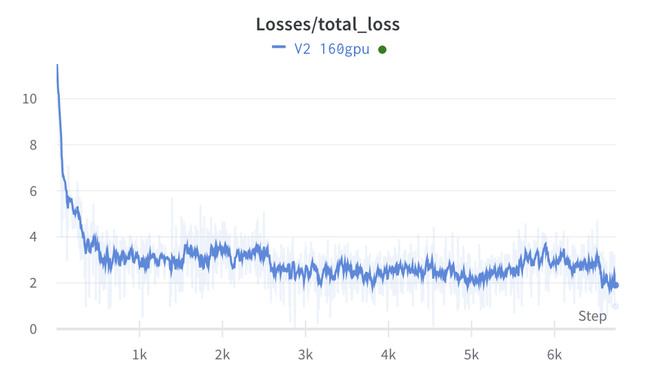

<!--
 * @Author: LiangSong(sl12160010@gmail.com)
 * @Date: 2023-03-10 21:18:35
 * @LastEditors: LiangSong(sl12160010@gmail.com)
 * @LastEditTime: 2023-03-27 02:40:54
 * @FilePath: /Open-Llama/README.md
 * @Description: 
 * 
 * Copyright (c) 2023 by LiangSong(sl12160010@gmail.com), All Rights Reserved. 
-->
# Open-Llama

[English](https://github.com/Bayes-Song/Open-Llama/blob/main/README_en.md)

Open-Llama是一个开源项目，提供了一整套用于构建大型语言模型的训练流程，从数据集准备到分词、预训练、指令调优，以及强化学习技术 RLHF。

## **特性**

### 易用性

我们认为易用性是构建大型语言模型时最重要的特性之一。为了使 Open-LLAMA 更加易于使用，我们特别注重了以下几点：

- **最简实现**：我们采用了最简单的实现方式，降低了入门的门槛，让初学者也能轻松上手。
- **流程完整**：我们发布了从数据集构建到训练的完整代码，使得构建一个大语言模型的每一步流程都清晰可见。

### 高性能

由于训练大语言模型的成本高昂，因此在构建大型语言模型时，高性能也是非常重要的。为了实现高性能的训练，我们发布使用了以下技术：

- **Fused CUDA kernel**：使用xformers中提供的 fused CUDA kernel 可以将多个操作融合在一起，减少了 GPU 和 CPU 之间的数据传输，从而提高了训练效率。
- **并行化训练**：我们使用Accelerate库支持在多个 GPU 上进行并行化训练，以加快训练速度。

对于7B模型，使用Transformers中Pytorch原生版本的Llama模型训练训练速度为1378 token/s/gpu，使用本代码库训练速度达到3290 token/s/gpu，基本达到Llama原文中的3370 token/s/gpu。
如果使用500B token进行预训练，需要训练43000 GPU时。按照Google Cloud上A100-80G Spot的价格计算，8卡每小时价格为12.6美元，则总价格为67725美元。
当使用未加速版本训练时，价格为158744美元。最终降低训练成本9万美元。
### 通用性

在训练语言模型时，我们希望能够构建一个通用的模型，可以适用于不同的语言和不同的领域。为了实现这一点，我们采用了以下策略：

- **多语言支持**：我们支持多种语言的语料库，包括英语、中文、日语等多种语言，让用户可以根据自己的需求进行选择。
- **领域通用性**：我们希望模型不仅能在日常问题上能产生帮助，同时希望在专业领域如科学、法律等也能帮助人类。

## **要求**

- Python 3.7 或更高版本
- PyTorch 1.11 或更高版本
- [Transformers库](https://huggingface.co/docs/transformers/index)
- [Accelerate库](https://huggingface.co/docs/accelerate/index)
- CUDA 11.1 或更高版本（用于 GPU 加速，基于CUDA11.7进行测试）

## **入门指南**
### 安装

使用下面的命令安装相关依赖

```bash
pip install -r requirements.txt
```

### 数据集准备

目前给出了智源开源的悟道数据集和EleutherAI开源的the pile数据集。数据集下载和处理代码在data目录下。
其中悟道数据集由于需要同意一些协议才能下载因此可能需要修改一下download_wudao中的链接，[悟道](https://data.baai.ac.cn/details/WuDaoCorporaText)。

运行下面的命令进行数据下载并进行分片
```bash
bash data/download_the_pile.sh
bash data/download_wudao.sh
```
数据将按照每个文件最大16384行存储为小文件，便于后续使用多进程训练时进行读取。存储格式为jsonl.zst，使用zstd进行压缩，最终数据大小为519.5G，合计16466个文件。

其中the pile数据集包含210607728行json line，悟道数据集包含59132213行json line。

具体数据格式如下
```
WuDao
{'id': 1, 'dataType': '百科', 'title': 'some title', 'content': 'some content'}

The Pile
{'text': 'some text', 'meta': {'pile_set_name': 'Github'}}
```

### 数据读取
数据读取相关代码可见dataset目录，其中包含根据下载的数据集使用SentencePiece训练分词模型，以及根据分词器构建DataLoader。

训练分词器使用如下命令
```bash
python3 dataset/train_tokenizer.py
```

使用如下命令查看DataLoader输出的结果
```bash
python3 dataset/pretrain_dataset.py
```

### 模型结构
我们基于Transformers库中的[Llama](https://github.com/facebookresearch/llama)参考论文原文中的2.4 Efficient implementation一节进行了修改，
同时还参考了一些其他论文引入了一些优化。具体来说，我们引入了由META开源的[xformers库](https://github.com/facebookresearch/xformers)中的memory_efficient_attention操作来进行
Self Attention的计算，这对于性能有明显的提升，提升大约30%。
具体可以参见[modeling_llama.py](https://github.com/Bayes-Song/transformers/blob/main/src/transformers/models/llama/modeling_llama.py#L240)

同时我们还参考了[Bloom](https://huggingface.co/bigscience/bloom)，对于Token Embedding引入了Stable Embedding以更好的稳定训练。

最后我们参考[PALM](https://arxiv.org/abs/2204.02311)，使用了Shared Input-Output Embeddings。

### 预训练
我们基于Accelerate库进行多GPU并行训练，启动命令如下
```bash
accelerate launch --config_file configs/default_config.yaml pretrain_llama.py
```
我们使用Wandb进行训练的可视化，需要自行修改环境变量 WANDB_API_KEY 。

其中我们使用了DeepSpeed stage1以减少显存占用。accelerate相关配置可见configs/default_config.yaml。

训练相关超参数可见configs/train_config.py，目前我们使用10W词表的7B Llama模型进行训练，具体配置如下

| max_length | batch_size | learning_rate | weight_decay | params | dimension | n heads | n layer | vocab_size |
|------------|------------------|---------------|--------------|--------|-----------|---------|---------|------------|
| 1024       | 2                | 2e-4          | 1e-1         | 6.88B  | 4096      | 32      | 32      | 100000     |

```
=========================================================================================================
Layer (type:depth-idx)                                  Output Shape              Param #
=========================================================================================================
LlamaForCausalLM                                        [1, 64, 32, 128]          --
├─LlamaModel: 1-1                                       [1, 64, 32, 128]          --
│    └─Embedding: 2-1                                   [1, 64, 4096]             409,600,000
│    └─LayerNorm: 2-2                                   [1, 64, 4096]             8,192
│    └─ModuleList: 2-3                                  --                        --
│    │    └─LlamaDecoderLayer: x32                      [1, 64, 4096]             202,383,360 x 32
│    └─LlamaRMSNorm: 2-4                                [1, 64, 4096]             4,096
=========================================================================================================
Total params: 6,885,879,808
Trainable params: 6,885,879,808
Non-trainable params: 0
Total mult-adds (G): 6.89
```

目前的进展


### Instruction-Tuning

### RLHF

## 性能对比

### 训练框架
在训练框架方面我们测试了HuggingFace开源的Accelerate库和HPC-AI开源的ColossalAI，我们测试在打满显卡时性能差异较小。因此最终选择了实现相对简单的Accelerate库作为训练框架

测试数据如下，测试过程中使用的模型结构为
| Model | n gpu | n layer | n heads | hidden size | vocab size | seq length |
|-------|-------|---------|---------|-------------|------------|------------|
| GPT2  | 2     | 6       | heads   | 4096        | 250100     | 1024       |

测试结果如下，可以看到当打满时速度和显存相差不大
|                 | HuggingFace                       | HuggingFace                        | ColossalAI                                             | ColossalAI                                             | ColossalAI                         |
|-----------------|-----------------------------------|------------------------------------|--------------------------------------------------------|--------------------------------------------------------|------------------------------------|
| config          | without activation ckpt, bs2      | without activation ckpt, max_bs=12 | with activation ckpt, bs2                              | without activation ckpt, bs2                           | without activation ckpt, max_bs=10 |
| second pre step | 0.336, fw=0.033, bw=0.3, opt=5e-6 | 1.25                               | 0.347                                                  | 0.308, fw=0.067, bw=0.152, opt=0.088                   | 1.055                              |
| gpu memory      | nvidia-smi 45445                  |                                    | fw+bw+opt=21053.63+22064.12+17987.52, nvidia-smi 40961 | fw+bw+opt=24684.74+21087.13+17987.52, nvidia-smi 46821 | oom after 10 steps, 疑似有内存泄漏 |

### 性能优化
在最早版本中我们使用DeepSpeed stage2 + Transformers中的原生Llama实现进行训练但是速度和论文中所说的相差较大，因此后续我们进行了一系列的优化，我们将每一步的性能提升列在下面可供参考。

论文中提到对于6.7B模型使用了1T token进行训练，最终的gpu时为82432，因此可以计算出他的训练速度大致为3370 token/s/gpu。
当使用下面的优化后速度开源基本和论文中速度一致，使用20x8 A100-80G进行测试。预计加入更多融合算子开源取得更好的性能。

|                     | V1           | V2                    |
|---------------------|--------------|-----------------------|
| Model               | Transformers | Transformers+xformers |
| Optimizer           | Pytorch Adam | Fused Adam            |
| DeepSpeed           | stage2       | stage1                |
| Grad Accumulation   | 4            | 12                    |
| Return Padding Mask | yes          | no                    |
| Speed token/s/gpu   | 1378         | 3290                  |

## 后续计划

1. 加入更多训练监控，比如训练数据类别的分布等，加入继续训练相关代码
2. 开源预训练好的多语言Llama 6.9B的checkpoint
3. 实现Instruction-tuning代码，并开源相关checkpoint
4. 使用Gradio搭建在线Demo
5. 使用[Triton](https://github.com/openai/triton)加入更多高性能算子，进一步提升性能
6. 加入根据Common Crawl构建预训练数据集相关代码，并开源相关数据集
7. 加入多模态训练代码

## 引用

```
@misc{openllama,
  title={Open-Llama},
  author={Liang Song},
  year={2023},
  howpublished={\url{https://github.com/Bayes-Song/Open-Llama}},
}
```