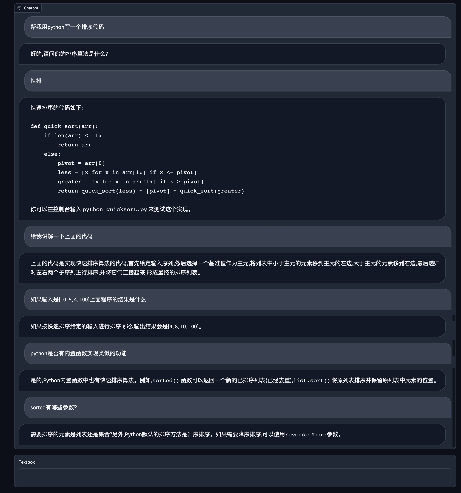
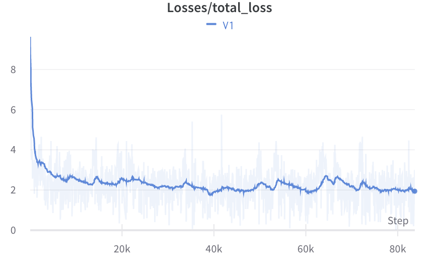

<!--
 * @Author: LiangSong(sl12160010@gmail.com)
 * @Date: 2023-03-10 21:18:35
 * @LastEditors: LiangSong(sl12160010@gmail.com)
 * @LastEditTime: 2023-05-14 10:52:08
 * @FilePath: /Open-Llama/README_zh.md
 * @Description: 
 * 
 * Copyright (c) 2023 by LiangSong(sl12160010@gmail.com), All Rights Reserved. 
-->
[**中文**](./README_zh.md) | [**English**](./README.md)


# Open-Llama

<p align="center">
    
    
    
    
</p>

Open-Llama是一个开源项目，提供了一整套用于构建大型语言模型的训练流程，从数据集准备到分词、预训练、指令调优，lora, 以及强化学习技术 RLHF。

**可从[Demo](http://home.ustc.edu.cn/~sl9292/)直接试用本模型。**

## **主要内容**

- **支持Transformers/HuggingFace直接调用。** 经过Instruct-tuning的CheckPoint已开源在[HuggingFace: s-JoL/Open-Llama-V2](https://huggingface.co/s-JoL/Open-Llama-V2)。

- **采用FastChat项目相同方法测评Open-Llama的效果和GPT3.5的效果对比，经过测试在中文问题上可以达到GPT3.5 89%的水平。**

- **训练速度达到3620 token/s，快于Llama原文中的3370 token/s，达到目前sota的水平。**


使用ckpt需要先用下面命令安装最新版本Transformers：
``` python
pip install git+https://github.com/huggingface/transformers.git

from transformers import AutoModelForCausalLM, AutoTokenizer

tokenizer = AutoTokenizer.from_pretrained("s-JoL/Open-Llama-V2", use_fast=False)
model = AutoModelForCausalLM.from_pretrained("s-JoL/Open-Llama-V2", device_map="auto")

inputs = tokenizer('user:implement quick sort in python\nsystem:', return_tensors='pt', return_attention_mask=False, add_special_tokens=False)
for k, v in inputs.items():
   inputs[k] = v.cuda()
pred = model.generate(**inputs, max_new_tokens=512, do_sample=True)
print(tokenizer.decode(pred.cpu()[0], skip_special_tokens=True))

```
只经过预训练的CheckPoint也上传至[s-JoL/Open-Llama-V2-pretrain](https://huggingface.co/s-JoL/Open-Llama-V2-pretrain)。
模型已提交[PR](https://github.com/huggingface/transformers/pull/22795)合并至Transformers main分支。

我们完成了330B token的预训练，总共训练80 K step，Global Batch Size和Llama中一致为4M。
使用总共7部分数据构成Instruction-tuning数据，模型具有一定的编程能力、数学能力和多轮对话能力，具体数据见Instruction-Tuning部分。

如下是一个关于代码的多轮对话能力的展示



## **更新**

**[2023.5.8] Release v2.1**

- 本次更新加入对更大模型训练的支持，使用DeepSpeed stage3 + offload + activation checkpoint可以在**单机8卡A100-80G训练65B模型**。

- 引入peft库**支持lora**等训练。

- 下表对比了Open-Llama和Llama原文的训练速度，Llama性能数据引自Llama原文。


|                | DeepSpeed Stage | Offload | Activation Checkpoint | Total Token | GPU hours | Speed token/s/gpu | Batch Size |
|----------------|-----------------|---------|-----------------------|-------------|-----------|-------------------|------------|
| Open-Llama 7B  | 1               | False   | False                 | 173.7B      | 13412     | 3587              | 2          |
| Open-Llama 13B | 3               | False   | True                  | -           | -         | 1856              | 24         |
| Open-Llama 33B | 3               | False   | True                  | -           | -         | 708               | 12         |
| Open-Llama 65B | 3               | True    | True                  | -           | -         | 369               | 12         |
| Llama 7B       | -               | -       | -                     | 1T          | 82432     | 3370              | -          |
| Llama 13B      | -               | -       | -                     | 1T          | 135168    | 2055              | -          |
| Llama 33B      | -               | -       | -                     | 1.4T        | 530432    | 733               | -          |
| Llama 65B      | -               | -       | -                     | 1.4T        | 1022362   | 380               | -          |

**[2023.4.28] Release v2.0**

本次更新主要包含以下几个方面，相对于v1版本提升有效训练速度**50%**，其中pad从**30%**减少至**5%**，训练速度从**3200token/s**提升至**3587token/s**。0.95 * 3600/(0.7 * 3200)=1.521
1. 使用HuggingFace的datasets库进行数据读取，具体流程如下
   1. 使用transform函数将不同数据集的数据统一格式为{'text': 'xxx'}
   2. 使用Tokenizer进行分词
   3. 对长序列进行采样，目前提供三种模式，分别是：截断/采样（参考[Gopher论文](https://arxiv.org/abs/2112.11446)）/切分
   4. 可选：对来自不同doc的文本进行拼接。减少了数据中的pad，加速训练；在v1版本中pad占比为**30%**，使用拼接后pad占比降低为**5%**。
2. 加入Trainer，对于预训练和指令微调都可以复用，见solver/trainer.py
3. 统一预训练和指令微调训练入口为train_lm.py
4. 提供更方便的配置，可见configs/pretrain_config.yaml
5. 提供基于其他预训练模型补充词表，继续预训练功能
6. 支持从中断点继续训练，包括加载优化器参数/学习率和跳过重复数据

[2023.4.16] Release v1.0

提供基础的预训练和指令微调代码，训练速度达到Llama原文速度。预训练和指令微调后的模型已经开源在HuggingFace。

v1版代码可见https://github.com/s-JoL/Open-Llama/tree/v1.0

## **特性**

### 易用性

我们认为易用性是构建大型语言模型时最重要的特性之一。为了使 Open-LLAMA 更加易于使用，我们特别注重了以下几点：

- **最简实现**：我们采用了最简单的实现方式，降低了入门的门槛，让初学者也能轻松上手。
- **流程完整**：我们发布了从数据集构建到训练的完整代码，使得构建一个大语言模型的每一步流程都清晰可见。

### 高性能

由于训练大语言模型的成本高昂，因此在构建大型语言模型时，高性能也是非常重要的。为了实现高性能的训练，我们发布使用了以下技术：

- **Fused CUDA kernel**：使用[xformers](https://github.com/facebookresearch/xformers)中提供的 fused CUDA kernel 可以将多个操作融合在一起，减少了 GPU 和 CPU 之间的数据传输，从而提高了训练效率。
- **并行化训练**：我们使用[Accelerate](https://huggingface.co/docs/accelerate/index)库支持在多个 GPU 上进行并行化训练，以加快训练速度。

对于7B模型，使用Transformers中Pytorch原生版本的Llama模型训练训练速度为**1378 token/s/gpu**，使用本代码库训练速度达到**3626 token/s/gpu**，超过[Llama原文](https://arxiv.org/pdf/2302.13971.pdf)中的**3370 token/s/gpu**。

如果使用500B token进行预训练，需要训练38300 GPU时。按照Google Cloud上A100-80G Spot的价格计算，8卡每小时价格为12.6美元，则总价格为60300美元。
当使用未加速版本训练时，价格为158744美元。最终降低训练成本9.8万美元。

更多测试可见[和其他开源模型性能对比](https://github.com/Bayes-Song/Open-Llama#%E5%92%8C%E5%85%B6%E4%BB%96%E5%BC%80%E6%BA%90%E6%A8%A1%E5%9E%8B%E6%80%A7%E8%83%BD%E5%AF%B9%E6%AF%94)。
### 通用性

在训练语言模型时，我们希望能够构建一个通用的模型，可以适用于不同的语言和不同的领域。为了实现这一点，我们采用了以下策略：

- **多语言支持**：我们支持多种语言的语料库，包括英语、中文、日语等多种语言，让用户可以根据自己的需求进行选择。
- **领域通用性**：我们希望模型不仅能在日常问题上能产生帮助，同时希望在专业领域如科学、法律等也能帮助人类。
- **和世界交互**：希望通过加入RL使得模型具备和世界交互的能力

## **要求**

- Python 3.7 或更高版本
- PyTorch 1.13
- [Transformers库](https://github.com/huggingface/transformers)
- [Accelerate库](https://huggingface.co/docs/accelerate/index)
- CUDA 11.6 或更高版本（用于 GPU 加速）
- 硬件配置：目前使用(64 CPU, 1000G Memory, 8xA100-80G) x N，有个比较神奇的现象当使用更多cpu时反而会慢一点，猜测这和dataloader的多进程有一定关系。

## **入门指南**
### 安装

使用下面的命令安装相关依赖

```bash
pip install -r requirements.txt
```

### 数据集准备

目前给出了智源开源的悟道数据集和EleutherAI开源的the pile数据集。数据集下载和处理代码在data目录下。
其中悟道数据集由于需要同意一些协议才能下载因此可能需要修改一下download_wudao中的链接，[悟道](https://data.baai.ac.cn/details/WuDaoCorporaText)。

感谢[@skepsun](https://github.com/skepsun)的建议，使用scidb下载wudao数据集不需要登陆，并且下载更稳定一些。https://github.com/s-JoL/Open-Llama/issues/42

**注意数据下载可能出现失败，建议将script中的下载和处理分成两部分来运行，可以将下载多运行机会，会自动断点续传。**

运行下面的命令进行数据下载并进行分片
```bash
bash data/download_the_pile.sh
bash data/download_wudao.sh
```
数据将按照每个文件最大16384行存储为小文件，便于后续使用多进程训练时进行读取。存储格式为jsonl.zst，使用zstd进行压缩，最终数据大小为519.5G，合计16466个文件。

其中the pile数据集包含210607728行json line，悟道数据集包含59132213行json line。

具体数据格式如下
```
WuDao
{'id': 1, 'dataType': '百科', 'title': 'some title', 'content': 'some content'}

The Pile
{'text': 'some text', 'meta': {'pile_set_name': 'Github'}}
```
验证数据完整性可见 [issue](https://github.com/s-JoL/Open-Llama/issues/5)

### 相关工具
在utils目录中提供了训练分词/补充现有分词模型和转换ckpt的代码。

使用SentencePiece训练分词器参考如下命令
```bash
python3 utils/train_tokenizer.py
```
在configs中提供了只使用wudao数据集训练的4w词表的分词模型 4w_cn_vocab_wudao15.model

根据已有分词模型补充词表参考
```bash
python3 utils/merge_tokenizer.py
```
根据META官方的分词模型和上面的4w中文合并为中英文双语的分词模型 llama_tokenizer_extended.model

转换现有的Llama模型ckpt参考
```bash
python3 utils/convert_ckpt.py
```

### 数据读取
数据读取相关代码可见dataset/dataset.py，包含了预训练和指令微调数据的处理，如需加入其他数据集只需要修改其中的transform函数。

数据读取流程如下：
1. 使用transform函数将不同数据集的数据统一格式为{'text': 'xxx'}
2. 使用Tokenizer进行分词
3. 对长序列进行采样，目前提供三种模式，分别是：截断/采样（参考Gopher论文）/切分
4. 可选：对来自不同doc的文本进行拼接。减少了数据中的pad，加速训练；在v1版本中pad占比为30%，使用拼接后pad占比降低为5%。

使用如下命令查看DataLoader输出的结果，并检查分词正确性
```bash
python3 dataset/dataset.py
```

### 模型结构
我们基于Transformers库中的[Llama](https://github.com/facebookresearch/llama)参考论文原文中的2.4 Efficient implementation一节进行了修改，
同时还参考了一些其他论文引入了一些优化。具体来说，我们引入了由META开源的[xformers库](https://github.com/facebookresearch/xformers)中的memory_efficient_attention操作来进行
Self Attention的计算，这对于性能有明显的提升，提升大约30%。
具体可以参见[modeling_llama.py](https://github.com/huggingface/transformers/blob/main/src/transformers/models/open_llama/modeling_open_llama.py#L229)

同时我们还参考了[Bloom](https://huggingface.co/bigscience/bloom)，对于Token Embedding引入了Stable Embedding以更好的稳定训练。

最后我们参考[PALM](https://arxiv.org/abs/2204.02311)，使用了Shared Input-Output Embeddings。

### 预训练
我们基于Accelerate库进行多GPU并行训练，启动命令如下
```bash
accelerate launch --config_file configs/accelerate_configs/ds_stage1.yaml train_lm.py --train_config configs/pretrain_config.yaml --model_config configs/model_configs/7B.json 
```
某些情况下可能需要指定下列参数
```
--main_process_ip
--main_process_port
--num_processes
--num_machines
--machine_rank
```
我们使用[Wandb](https://wandb.ai/)进行训练的可视化，需要自行修改环境变量 WANDB_API_KEY 。

其中我们使用了DeepSpeed stage1以减少显存占用。accelerate相关配置可见configs/accelerate_configs。

训练相关超参数可见configs/pretrain_config.yaml

其中默认参数为使用LlamaTokenizer补充4w中文的词表的分词模型，模型大小为7B，具体配置如下

| max_length | batch_size | learning_rate | weight_decay | params | dimension | n heads | n layer | vocab_size |
|------------|------------------|---------------|--------------|--------|-----------|---------|---------|------------|
| 2048       | 2                | 2e-4          | 1e-1         | 7.03B  | 4096      | 32      | 32      | 68762      |

```
==============================================================================================================
Layer (type:depth-idx)                                       Output Shape              Param #
==============================================================================================================
OpenLlamaForCausalLM                                         [1, 32, 64, 128]          --
├─OpenLlamaModel: 1-1                                        [1, 32, 64, 128]          --
│    └─Embedding: 2-1                                        [1, 64, 4096]             281,649,152
│    └─ModuleList: 2-2                                       --                        --
│    │    └─OpenLlamaDecoderLayer: 3x32                      [1, 64, 4096]             202,383,360
│    └─OpenLlamaRMSNorm: 2-3                                 [1, 64, 4096]             4,096
├─Linear: 1-2                                                [1, 64, 68762]            281,649,152
==============================================================================================================
Total params: 7,039,569,920
Trainable params: 7,039,569,920
Non-trainable params: 0
Total mult-adds (G): 7.04
```

从头预训练Loss如下


### Instruction-Tuning

我们使用目前开源的七个数据集进行Instruction-tuning，后续会加入更多的任务以及自己构建的数据集。
- [yizhongw/self_instruct](https://huggingface.co/datasets/yizhongw/self_instruct)
- [BelleGroup/train_0.5M_CN](https://huggingface.co/datasets/BelleGroup/train_0.5M_CN)
- [BelleGroup/train_1M_CN](https://huggingface.co/datasets/BelleGroup/train_1M_CN)
- [BelleGroup/multiturn_chat_0.8M](https://huggingface.co/datasets/BelleGroup/multiturn_chat_0.8M)
- [BelleGroup/school_math_0.25M](https://huggingface.co/datasets/BelleGroup/school_math_0.25M)
- [anon8231489123/ShareGPT_Vicuna_unfiltered](https://huggingface.co/datasets/anon8231489123/ShareGPT_Vicuna_unfiltered)
- [Graverman/Instruct-to-Code](https://huggingface.co/datasets/Graverman/Instruct-to-Code)

其中ShareGPT_Vicuna_unfiltered数据在datastes的处理有些问题，我们直接下载原数据重新进行了处理。
我们对原始数据进行了一些预处理，格式如下
```
user: {prompt}\nsystem: {completion}</s>
```

启动命令和预训练基本一致
```bash
accelerate launch --config_file configs/accelerate_configs/ds_stage1.yaml train_lm.py --train_config configs/instruct_config.yaml --model_config configs/model_configs/7B.json 
```
某些情况下可能需要指定下列参数
```
--main_process_ip
--main_process_port
--num_processes
--num_machines
--machine_rank
```

过程中Loss如下，总计使用3个epoch

### RLHF
暂无
### Server

多轮对话使用chat_server.py

基于Gradio开发。 
## 性能对比

### 训练框架
在训练框架方面我们测试了HuggingFace开源的Accelerate库pytorch-lightning和HPC-AI开源的ColossalAI，我们测试在打满显卡时性能差异较小。因此最终选择了实现相对简单的Accelerate库作为训练框架

测试代码可见utils/speed_test.py

测试过程中使用的模型结构为
| Model | n gpu | n layer | n heads | hidden size | vocab size | seq length |
|-------|-------|---------|---------|-------------|------------|------------|
| GPT2  | 2     | 6       | heads   | 4096        | 250100     | 1024       |

测试结果如下，可以看到当打满时速度和显存相差不大
|                 | HuggingFace                       | HuggingFace                        | ColossalAI                                             | ColossalAI                                             | ColossalAI                         |
|-----------------|-----------------------------------|------------------------------------|--------------------------------------------------------|--------------------------------------------------------|------------------------------------|
| config          | without activation ckpt, bs2      | without activation ckpt, max_bs=12 | with activation ckpt, bs2                              | without activation ckpt, bs2                           | without activation ckpt, max_bs=10 |
| second pre step | 0.336, fw=0.033, bw=0.3, opt=5e-6 | 1.25                               | 0.347                                                  | 0.308, fw=0.067, bw=0.152, opt=0.088                   | 1.055                              |
| gpu memory      | nvidia-smi 45445                  |                                    | fw+bw+opt=21053.63+22064.12+17987.52, nvidia-smi 40961 | fw+bw+opt=24684.74+21087.13+17987.52, nvidia-smi 46821 | oom after 10 steps, 疑似有内存泄漏 |

### 性能优化
在最早版本中我们使用DeepSpeed stage2 + Transformers中的原生Llama实现进行训练但是速度和论文中所说的相差较大，因此后续我们进行了一系列的优化，我们将每一步的性能提升列在下面可供参考。

论文中提到对于6.7B模型使用了1T token进行训练，最终的gpu时为82432，因此可以计算出他的训练速度大致为3370 token/s/gpu。
当使用下面的优化后速度开源基本和论文中速度一致，使用20x8 A100-80G进行测试。预计加入更多融合算子开源取得更好的性能。

|                     | V1           | V2                                 |
|---------------------|--------------|------------------------------------|
| Dataset             | self implemented | datasets                       |
| Model               | Transformers     | Transformers+xformers          |
| Optimizer           | Pytorch Adam     | Fused Adam                     |
| DeepSpeed           | stage2           | stage1                         |
| Grad Accumulation   | 4                | 12                             |
| Return Padding Mask | yes              | no                             |
| Speed token/s/gpu   | 1378             | 3637                           |

### 和其他开源模型性能对比
下表是一个对目前开源模型性能的一个总结，使用GPU device均为A100，由于模型大小各不相同结构也有一定差异，难以准确的对比性能，作为一个粗略估计可以认为速度和模型参数量基本呈反比关系，这一点看Llama不同大小的模型可以得到印证。基于这个粗略估计可以看到使用本项目的性能明显由于其他项目。

| Model               | Open-Llama | LLAMA    | LLAMA   | LLAMA     | OPT     | Bloom              | GLM   | GPT-NEOX | CPM-ANT | CodeGeeX  |
|---------------------|------------|----------|---------|-----------|---------|--------------------|-------|----------|---------|-----------|
| Model size          | 7.0B       | 6.7B     | 13B     | 65B       | 175B    | 175B               | 130B  | 20B      | 10B     | 13B       |
| Token               |            | 1T       | 1T      | 1.4T      | 180B    | 366B               | 400B  | 402B     | 200B    | 13.9B     |
| GPU Hour            |            | 82,432   | 135,168 | 1,022,362 | 809,472 | 1,082,990          | 43776 | 175680   | 47040   | 3072      |
| speed token/s/gpu   | 3637       | 3370     | 2055    | 380       | 61.8    | 93.9               | 105.7 | 635.6    | 1181    | 1257      |
| 相关依赖             | xformers   | xformers |         |           | measeq  | Megatron-DeepSpeed |       |          | BMtrain | MindSpore |
| speed token*params B/s/gpu | 25728      | 22579    | 26715   | 24700     | 10815   | 16432              | 13741 | 12712    | 11810   | 16341     |

## 后续计划

1. 加入RLHF代码
2. 使用[Triton](https://github.com/openai/triton)加入更多高性能算子，进一步提升性能
3. 加入根据Common Crawl构建预训练数据集相关代码，并开源相关数据集
4. 加入多模态训练代码

## 引用

```
@misc{openllama,
  title={Open-Llama},
  author={Liang Song},
  year={2023},
  howpublished={\url{https://github.com/s-JoL/Open-Llama}},
}
```

<p align="center">
  <a href="https://star-history.com/#s-JoL/Open-Llama&Date">
    
  </a>
</p>

<!-- 一些之前没注意到的部分

1. [GPT3](https://arxiv.org/pdf/2005.14165.pdf), Details of Model Training

During training we always train on sequences of the full nctx = 2048 token context window, packing multiple documents into a single sequence when documents are shorter than 2048, in order to increase computational efficiency. Sequences with multiple documents are not masked in any special way but instead documents within a sequence are delimited with a special end of text token, giving the language model the information necessary to infer that context separated by the end of text token is unrelated. This allows for efficient training without need for any special sequence-specific masking.

在[PALM](https://arxiv.org/pdf/2204.02311.pdf)中也有类似的说法
Sequence length – A sequence length of 2048 was used for all models. Input examples are concatenated together and then split into sequences of exactly 2048 tokens, so that there are no padding tokens, but examples may be split in the middle. Input examples are differentiated from one another with a special [eod] token.

2. GPT3,  Common Crawl Filtering

使用高质量文本作为正例，其他所有样本作为负例。根据判为正例的概率作为筛选np.random.pareto(α) > 1 − document_score。
思想是尽量使用和高质量样本相似的数据。
The classifier is trained using logistic regression classifier with features from Spark’s standard tokenizer and HashingTF.

3. GPT3, fuzzy deduplication

使用MinHashLSH进行去重，同时把CC中的WebText部分数据去掉。这些特征和分类器使用的一致。
we fuzzily deduplicated documents (i.e. removed documents with high overlap with other documents) within each dataset using Spark’s MinHashLSH implementation with 10 hashes

4. GPT3, Test Set Contamination

5. [The pile](https://arxiv.org/pdf/2101.00027.pdf), BPB(bits per UTF-8 encoded byte)/bits per character/perplexity

$
BPB = = (L_T /L_B)l/ ln(2) \\
perplexity = P(w1, w2, w3, w4, ...)^{-\frac{1}{N}} \\
bpc=-\frac{1}{T}\sum_i log_2 P(w_i|w1, w2, ..., w_{i-1}) \\
2^{bpc}=(\prod_i P(w_i|w1, w2, ..., w_{i-1}))^{-\frac{1}{T}}=perplexity
$
bpc是字符粒度，和分词算法相关。而bpb为byte粒度，与分词算法无关。

可以使用bpb的差异衡量不同数据的难度。

6. The pile, diversity of the collected data

数据多样性

We hypothesize that this is due to the perplexity based filtering used in CC-100, where a language model is trained on Wikipedia and all data with a perplexity too high or too low is discarded. This effectively discards any data too similar to or too different from Wikipedia, which severely limits the diversity of the collected data. 

7. The pile, bytes per token

Since the GPT-2 BPE tokenizer is trained on WebText, the mean bytes per token is also a very rough indicator of how syntactically different each Pile component is from WebText.

8. The pile, Deduplication

We used 10 hash functions for each Minhash and an approximate Jaccard similarity of 0.5.

9. GLM, Embedding Layer Gradient Shrink 

和stable embedding类似
$
word-embedding = word-embedding*\alpha+word-embedding.detach() ∗ (1−\alpha)
$

10. PALM, Training Instability

训练中的loss尖峰是由特定的数据和特定的参数共同造成，使用模型回滚+跳过部分数据解决。
Instead, we found that a simple strategy to effectively mitigate the issue: We re-started training from a checkpoint roughly 100 steps before the spike started, and skipped roughly 200–500 data batches, which cover the batches that were seen before and during the spike. With this mitigation, the loss did not spike again at the same point. We do not believe that the spikes were caused by “bad data” per se, because we ran several ablation experiments where we took the batches of data that were surrounding the spike, and then trained on those same data batches starting from a different, earlier checkpoint. In these cases, we did not see a spike. This implies that spikes only occur due to the combination of specific data batches with a particular model parameter state


11. [Chinchilla](https://arxiv.org/pdf/2203.15556.pdf), Optimal model scaling

20 tokens per parameter, for example 10B model should use 200B tokens to pretrain

12. [Gopher](https://arxiv.org/pdf/2112.11446.pdf), Quality Filtering

Quality Filtering (MassiveWeb only) The vast majority of text found on the web is of insufficient
quality to be useful for language model training. For example, many web pages contain primarily
automatically generated content, or text that is not intended for human consumption (such as keywords
for search-engine optimisation). Much of the web also comprises social media content, which can
variously lack context, coherence, or substance. To remove low-quality data while minimising potential
for bias, we apply a number of simple, easily understood heuristic filters: we remove any document
that does not contain between 50 and 100,000 words, or whose mean word length is outside the
range of 3 to 10 characters; we remove any document with a symbol-to-word ratio greater than 0.1
for either the hash symbol or the ellipsis; and we remove any document with more than 90% of lines
starting with a bullet point, or more than 30% ending with an ellipsis. We also require that 80%
of words in a document contain at least one alphabetic character, and apply a "stop word" filter, to
remove documents that do not contain at least two of the following English words: the, be, to, of, and,
that, have, with; this adequately deals with ostensibly English documents that contain no coherent
English text.

13. Gopher, Constructing Token Sequences

和GPT3中的避免mask的方法类似
 -->
